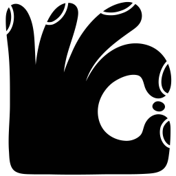

<div align="center">
  
</div>

<br />

<div align="center">
  <a href="https://npmjs.org/package/wouter"></a>
  <a href="https://travis-ci.org/molefrog/wouter"></a>
  <a href="https://codecov.io/gh/molefrog/wouter"></a>
  <a href="https://www.npmjs.com/package/wouter"></a>
  <a href="https://pr.new/molefrog/wouter"></a>
</div>

<div align="center">
  <b>wouter</b> is a tiny router for modern React and Preact apps that relies on Hooks. <br />
  A router you wanted so bad in your project!<br>
</div>

## Features


- Minimum dependencies, only **2.1 KB** gzipped vs 18.7KB
  [React Router](https://github.com/ReactTraining/react-router).
- Supports both **React** and **[Preact](https://preactjs.com/)**! Read
  _["Preact support" section](#preact-support)_ for more details.
- No top-level `<Router />` component, it is **fully optional**.
- Mimics [React Router](https://github.com/ReactTraining/react-router)'s best practices by providing
  familiar **[`Route`](#route-pathpattern-)**, **[`Link`](#link-hrefpath-)**,
  **[`Switch`](#switch-)** and **[`Redirect`](#redirect-topath-)** components.
- Has hook-based API for more granular control over routing (like animations):
  **[`useLocation`](#uselocation-working-with-the-history)**,
  **[`useRoute`](#useroute-the-power-of-hooks)** and
  **[`useRouter`](#userouter-accessing-the-router-object)**.

## developers :sparkling_heart: wouter

> ... I love Wouter. It’s tiny, fully embraces hooks, and has an intuitive and barebones API. I can
> accomplish everything I could with react-router with Wouter, and it just feels **more minimalist
> while not being inconvenient.**
>
> [**Matt Miller**, _An exhaustive React ecosystem for 2020_](https://medium.com/@mmiller42/an-exhaustive-react-guide-for-2020-7859f0bddc56)

Wouter provides a simple API that many developers and library authors appreciate. Some notable
projects that use wouter: **[Ultra](https://ultrajs.dev/)**,
**[React-three-fiber](https://github.com/react-spring/react-three-fiber)**,
**[Sunmao UI](https://sunmao-ui.com/)**, **[Million](https://millionjs.org/)** and many more.

## Table of Contents

- [Getting Started](#getting-started)
  - [Browser Support](#browser-support)
- [Wouter API](#wouter-api)
  - [The list of methods available](#the-list-of-methods-available)
- [Hooks API](#hooks-api)
  - [`useRoute`: route matching and parameters](#useroute-route-matching-and-parameters)
  - [`useLocation`: working with the history](#uselocation-working-with-the-history)
    - [Additional navigation parameters](#additional-navigation-parameters)
    - [Customizing the location hook](#customizing-the-location-hook)
  - [`useParams`: extracting matched parameters](#useparams-extracting-matched-parameters)
  - [`useSearch`: query strings](#usesearch-query-strings)
  - [`useRouter`: accessing the router object](#userouter-accessing-the-router-object)
- [Component API](#component-api)

  - [`<Route path={pattern} />`](#route-pathpattern-)
    - [Route nesting](#route-nesting)
  - [`<Link href={path} />`](#link-hrefpath-)
  - [`<Switch />`](#switch-)
  - [`<Redirect to={path} />`](#redirect-topath-)
  - [`<Router hook={hook} matcher={matchFn} base={basepath} />`](#router-hookhook-matchermatchfn-basebasepath-)

- [FAQ and Code Recipes](#faq-and-code-recipes)
  - [I deploy my app to the subfolder. Can I specify a base path?](#i-deploy-my-app-to-the-subfolder-can-i-specify-a-base-path)
  - [How do I make a default route?](#how-do-i-make-a-default-route)
  - [How do I make a link active for the current route?](#how-do-i-make-a-link-active-for-the-current-route)
  - [Are strict routes supported?](#are-strict-routes-supported)
  - [Are relative routes and links supported?](#are-relative-routes-and-links-supported)
  - [Can I initiate navigation from outside a component?](#can-i-initiate-navigation-from-outside-a-component)
  - [Can I use _wouter_ in my TypeScript project?](#can-i-use-wouter-in-my-typescript-project)
  - [Preact support?](#preact-support)
  - [Server-side Rendering support (SSR)?](#server-side-rendering-support-ssr)
  - [1KB is too much, I can't afford it!](#1kb-is-too-much-i-cant-afford-it)
- [Acknowledgements](#acknowledgements)

## Getting Started

Check out this simple demo app below. It doesn't cover hooks and other features such as nested routing, but it's a good starting point for those who are migrating from React Router.

```js
import { Link, Route, Switch } from "wouter";

const App = () => (
  <>
    <Link href="/users/1">Profile</Link>

    <Route path="/about">About Us</Route>

    {/* 
      Routes below are matched exclusively -
      the first matched route gets rendered
    */}
    <Switch>
      <Route path="/inbox" component={InboxPage} />

      <Route path="/users/:name">
        {(params) => <>Hello, {params.name}!</>}
      </Route>

      {/* Default route in a switch */}
      <Route>404: No such page!</Route>
    </Switch>
  </>
);
```

### Browser Support

This library is designed for **ES2019+** compatibility. If you need to support older browsers, make sure that you transpile `node_modules`. Additionally, the minimum supported TypeScript version is 4.1 in order to support route parameter inference.

## Wouter API

Wouter comes with three kinds of APIs: low-level **standalone location hooks**, hooks for **routing and pattern matching** and more traditional **component-based
API** similar to React Router's one.

You are free to choose whatever works for you: use location hooks when you want to keep your app as small as
possible and don't need pattern matching; use routing hooks when you want to build custom routing components; or if you're building a traditional app
with pages and navigation — components might come in handy.

Check out also [FAQ and Code Recipes](#faq-and-code-recipes) for more advanced things like active
links, default routes, server-side rendering etc.

### The list of methods available

**Location Hooks**

These can be used separately from the main module and have an interface similar to `useState`. These hooks don't support nesting, base path, route matching.

- **[`import { useBrowserLocation } from "wouter/use-browser-location"`](https://github.com/molefrog/wouter/blob/v3/packages/wouter/src/use-browser-location.js)** —
  allows to manipulate current location in the browser's address bar, a tiny wrapper around the History API.

- **[`import { useHashLocation } from "wouter/use-hash-location"`](https://github.com/molefrog/wouter/blob/v3/packages/wouter/src/use-hash-location.js)** — similarly, gets location from the hash part of the address, i.e. the string after a `#`.

- **[`import { memoryLocation } from "wouter/memory-location"`](#uselocation-working-with-the-history)** — an in-memory location hook with history support, external navigation and immutable mode for testing. **Note** the module name because it is a high-order hook.

**Routing Hooks**

Import from `wouter` module.

- **[`useLocation`](#uselocation-working-with-the-history)** — allows to manipulate current
  router's location, by default subscribes to browser location. **Note:** this isn't the same as `useBrowserLocation`, read below.
- **[`useRoute`](#useroute-the-power-of-hooks)** — shows whether or not current page matches the
  pattern provided.

- **[`useRouter`](#userouter-accessing-the-router-object)** — returns a global router object that
  holds the configuration. Only use it if you want to customize the routing.

**Components**

Import from `wouter` module.

- **[`<Route />`](#route-pathpattern-)** — conditionally renders a component based on a pattern.
- **[`<Link />`](#link-hrefpath-)** — wraps `<a>`, allows to perfom a navigation.
- **[`<Switch />`](#switch-)** — exclusive routing, only renders the first matched route.
- **[`<Redirect />`](#redirect-topath-)** — when rendered, performs an immediate navigation.
- **[`<Router />`](#router-hookhook-matchermatchfn-basebasepath-)** — an optional top-level
  component for advanced routing configuration.

## Hooks API

### `useRoute`: route matching and parameters

Checks if the current location matches the pattern provided and returns an object with parameters. This is powered by a wonderful [`regexparam`](https://github.com/lukeed/regexparam) library, so all its pattern syntax is fully supported.

You can use `useRoute` to perform manual routing or implement custom logic, such as route transitions, etc.

```js
import { useRoute } from "wouter";

const Users = () => {
  // `match` is a boolean
  const [match, params] = useRoute("/users/:name");

  if (match) {
    return <>Hello, {params.name}!</>;
  } else {
    return null;
  }
};
```

A quick cheatsheet of what types of segments are supported:

```js
useRoute("/app/:page");
useRoute("/app/:page/:section");

// optional parameter, matches "/en/home" and "/home"
useRoute("/:locale?/home");

// suffixes
useRoute("/movies/:title.(mp4|mov)");

// wildcards, matches "/app", "/app-1", "/app/home"
useRoute("/app*");

// optional wildcards, matches "/orders", "/orders/"
// and "/orders/completed/list"
useRoute("/orders/*?");
```

The second item in the pair `params` is an object with parameters or null if there was no match. For wildcard segments the parameter name is `"*"`:

```js
// wildcards, matches "/app", "/app-1", "/app/home"
const [match, params] = useRoute("/app*");

if (match) {
  // "/home" for "/app/home"
  const page = params["*"];
}
```

### `useLocation`: working with the history

To get the current path and navigate between pages, call the `useLocation` hook. Similarly to `useState`, it returns a value and a setter: the component will re-render when the location changes and by calling `navigate` you can update this value and perform navigation.

By default, it uses `useBrowserLocation` under the hood, though you can configure this in a top-level `Router` component (for example, if you decide at some point to switch to a hash-based routing). `useLocation` will also return scoped path when used within nested routes or with base path setting.

```js
import { useLocation } from "wouter";

const CurrentLocation = () => {
  const [location, setLocation] = useLocation();

  return (
    <div>
      {`The current page is: ${location}`}
      <a onClick={() => setLocation("/somewhere")}>Click to update</a>
    </div>
  );
};
```

All the components internally call the `useLocation` hook.

#### Additional navigation parameters

The setter method of `useLocation` can also accept an optional object with parameters to control how
the navigation update will happen.

When browser location is used (default), `useLocation` hook accepts `replace` flag to tell the hook to modify the current
history entry instead of adding a new one. It is the same as calling `replaceState`.

```jsx
const [location, navigate] = useLocation();

navigate("/jobs"); // `pushState` is used
navigate("/home", { replace: true }); // `replaceState` is used
```

Additionally, you can provide a `state` option to update `history.state` while navigating:

```jsx
navigate("/home", { modal: "promo" });

history.state; // { modal: "promo" }
```

#### Customizing the location hook

By default, **wouter** uses `useLocation` hook that reacts to `pushState` and `replaceState`
navigation via `useBrowserLocation`.

To customize this, wrap your app in a `Router` component:

```js
import { Router, Route } from "wouter";
import { useHashLocation } from "wouter/use-hash-location";

const App = () => (
  <Router hook={useHashLocation}>
    <Route path="/about" component={About} />
    ...
  </Router>
);
```

Because these hooks have return values similar to `useState`, it is easy and fun to build your own location hooks: `useCrossTabLocation`, `useLocalStorage`, `useMicroFrontendLocation` and whatever routing logic you want to support in the app. Give it a try!

### `useParams`: extracting matched parameters

This hook allows you to access the parameters exposed through [matching dynamic segments](#matching-dynamic-segments). Internally, we simply wrap your components in a context provider allowing you to access this data anywhere within the `Route` component.

This allows you to avoid "prop drilling" when dealing with deeply nested components within the route. **Note:** `useParams` will only extract parameters from the closest parent route.

```js
import { Route, useParams } from "wouter";

const User = () => {
  const params = useParams();

  params.id; // "1"
};

<Route path="/user/:id" component={User}> />
```

### `useSearch`: query strings

Use this hook to get the current search (query) string value. It will cause your component to re-render only when the string itself and not the full location updates. The search string returned **does not** contain a `?` character.

```jsx
import { useSearch } from "wouter";

// returns "tab=settings&id=1"
// the hook for extracting search parameters is coming soon!
const searchString = useSearch();
```

For the SSR, use `ssrSearch` prop passed to the router.

```jsx
<Router ssrSearch={request.search}>{/* SSR! */}</Router>
```

Refer to [Server-Side Rendering](#server-side-rendering-support-ssr) for more info on rendering and hydration.

### `useRouter`: accessing the router object

If you're building advanced integration, for example custom location hook, you might want to get
access to the global router object. Router is a simple object that holds routing options that you configure in the `Router` component.

```js
import { useRouter } from "wouter";

const Custom = () => {
  const router = useRouter();

  router.hook; // `useBrowserLocation` by default
  router.base; // "/app"
};

const App = () => (
  <Router base="/app">
    <Custom />
  </Router>
);
```

## Component API

### `<Route path={pattern} />`

`Route` represents a piece of the app that is rendered conditionally based on a pattern `path`. Pattern has the same syntax as the argument you pass to [`useRoute`](#useroute-route-matching-and-parameters).

The library provides multiple ways to declare a route's body:

```js
import { Route } from "wouter";

// simple form
<Route path="/home"><Home /></Route>

// render-prop style
<Route path="/users/:id">
  {params => <UserPage id={params.id} />}
</Route>

// the `params` prop will be passed down to <Orders />
<Route path="/orders/:status" component={Orders} />
```

#### Route Nesting

Nesting is a core feature of wouter and can be enabled on a route via the `nest` prop. When this prop is present, the route matches everything that starts with a given pattern and it creates a nested routing context. All child routes will receive location relative to that pattern.

Let's take a look at this example:

```js
<Route path="/app" nest>
  <Route path="/users/:id" nest>
    <Route path="/orders" />
  </Route>
</Route>
```

1. This first route will be active for all paths that start with `/app`, this is equivalent to having a base path in your app.

2. The second one uses dynamic pattern to match paths like `/app/user/1`, `/app/user/1/anything` and so on.

3. Finally, the inner-most route will only work for paths that look like `/app/users/1/orders`. The match is strict, since that route does not have a `nest` prop and it works as usual.

If you call `useLocation()` inside the last route, it will return `/orders` and not `/app/users/1/orders`. This creates a nice isolation and it makes it easier to make changes to parent route without worrying that the rest of the app will stop working. If you need to navigate to a top-level page however, you can use a prefix `~` to refer to an absolute path:

```js
<Route path="/payments" nest>
  <Route path="/all">
    <Link to="~/home">Back to Home</Link>
  </Route>
</Route>
```

### `<Link href={path} />`

Link component renders an `<a />` element that, when clicked, performs a navigation.

```js
import { Link } from "wouter"

<Link href="/">Home</Link>

// `to` is an alias for `href`
<Link to="/">Home</Link>

// all standard `a` props are proxied
<Link href="/" className="link" aria-label="Go to homepage">Home</Link>

// all location hook options are supported
<Link href="/" replace state={{ animate: true }} />
```

Link will always wrap its children in an `<a />` tag, unless `asChild` prop is provided. Use this when you need to have a custom component that renders an `<a />` under the hood.

```jsx
// use this instead
<Link to="/" asChild>
  <UIKitLink />
</Link>

// Remember, `UIKitLink` must implement an `onClick` handler
// in order for navigation to work!
```

### `<Switch />`

There are cases when you want to have an exclusive routing: to make sure that only one route is
rendered at the time, even if the routes have patterns that overlap. That's what `Switch` does: it
only renders **the first matching route**.

```js
import { Route, Switch } from "wouter";

<Switch>
  <Route path="/orders/all" component={AllOrders} />
  <Route path="/orders/:status" component={Orders} />

  {/* 
     in wouter, any Route with empty path is considered always active. 
     This can be used to achieve "default" route behaviour within Switch. 
     Note: the order matters! See examples below.
  */}
  <Route>This is rendered when nothing above has matched</Route>
</Switch>;
```

When no route in switch matches, the last empty `Route` will be used as a fallback. See [**FAQ and Code Recipes** section](#how-do-i-make-a-default-route) to read about default routes.

### `<Redirect to={path} />`

When mounted performs a redirect to a `path` provided. Uses `useLocation` hook internally to trigger
the navigation inside of a `useEffect` block.

`Redirect` can also accept props for [customizing how navigation will be performed](#additional-navigation-parameters), for example for setting history state when navigating. These options are specific to the currently used location hook.

```jsx
<Redirect to="/" />

// arbitrary state object
<Redirect to="/" state={{ modal: true }} />

// use `replaceState`
<Redirect to="/" replace />
```

If you need more advanced logic for navigation, for example, to trigger the redirect inside of an
event handler, consider using
[`useLocation` hook instead](#uselocation-working-with-the-history):

```js
import { useLocation } from "wouter";

const [location, setLocation] = useLocation();

fetchOrders().then((orders) => {
  setOrders(orders);
  setLocation("/app/orders");
});
```

### `<Router hook={hook} matcher={matchFn} base={basepath} />`

Unlike _React Router_, routes in wouter **don't have to be wrapped in a top-level component**. An
internal router object will be constructed on demand, so you can start writing your app without
polluting it with a cascade of top-level providers. There are cases however, when the routing
behaviour needs to be customized.

These cases include hash-based routing, basepath support, custom matcher function etc.

A router is a simple object that holds the routing configuration options. You can always obtain this
object using a [`useRouter` hook](#userouter-accessing-the-router-object). The list of currently
available options:

- **`hook: () => [location: string, setLocation: fn]`** — is a React Hook function that subscribes
  to location changes. It returns a pair of current `location` string e.g. `/app/users` and a
  `setLocation` function for navigation. You can use this hook from any component of your app by
  calling [`useLocation()` hook](#uselocation-working-with-the-history).

Read more → [Customizing the location hook](#customizing-the-location-hook).

- **`matcher: (pattern: string, path: string) => [match: boolean, params: object]`** — a custom
  function used for matching the current location against the user-defined patterns like
  `/app/users/:id`. Should return a match result and an hash of extracted parameters. It should
  return `[false, null]` when there is no match.

- **`base: string`** — an optional setting that allows to specify a base path, such as `/app`. All
  application routes will be relative to that path. Prefixing a route with `~` will make it
  absolute, bypassing the base path.

## FAQ and Code Recipes

### I deploy my app to the subfolder. Can I specify a base path?

You can! Wrap your app with `<Router base="/app" />` component and that should do the trick:

```js
import { Router, Route, Link } from "wouter";

const App = () => (
  <Router base="/app">
    {/* the link's href attribute will be "/app/users" */}
    <Link href="/users">Users</Link>

    <Route path="/users">The current path is /app/users!</Route>
  </Router>
);
```

Calling `useLocation()` within a route in an app with base path will return a path scoped to the base. Meaning that when base is `"/app"` and pathname is `"/app/users"` the returned string is `"/users"`. Accordingly, calling `navigate` will automatically append the base to the path argument for you.

When you have multiple nested routers, base paths are inherited and stack up.

```js
<Router base="/app">
  <Router base="/cms">
    <Route path="/users">Path is /app/cms/users!</Route>
  </Router>
</Router>
```

### How do I make a default route?

One of the common patterns in application routing is having a default route that will be shown as a
fallback, in case no other route matches (for example, if you need to render 404 message). In
**wouter** this can easily be done as a combination of `<Switch />` component and a default route:

```js
import { Switch, Route } from "wouter";

<Switch>
  <Route path="/about">...</Route>
  <Route>404, Not Found!</Route>
</Switch>;
```

_Note:_ the order of switch children matters, default route should always come last.

If you want to have access to the matched segment of the path you can use wildcard parameters:

```js
<Switch>
  <Route path="/users">...</Route>

  {/* will match anything that starts with /users/, e.g. /users/foo, /users/1/edit etc. */}
  <Route path="/users/*">...</Route>

  {/* will match everything else */}
  <Route path="*">
    {(params) => `404, Sorry the page ${params["*"]} does not exist!`}
  </Route>
</Switch>
```

**[▶ Demo Sandbox](https://codesandbox.io/s/oqk302k2y)**

### How do I make a link active for the current route?

There are cases when you need to highlight an active link, for example, in the navigation bar. While
this functionality isn't provided out-of-the-box, you can easily write your own `<Link />` wrapper
and detect if the path is active by using the `useRoute` hook. The `useRoute(pattern)` hook returns
a pair of `[match, params]`, where `match` is a boolean value that tells if the pattern matches
current location:

```js
const [isActive] = useRoute(props.href);

return (
  <Link {...props}>
    <a className={isActive ? "active" : ""}>{props.children}</a>
  </Link>
);
```

**[▶ Demo Sandbox](https://codesandbox.io/s/5zjpj19yz4)**

### Are strict routes supported?

If a trailing slash is important for your app's routing, you could specify a custom parser. Parser is a method that takes a pattern string and returns a RegExp and an array of parsed key. It uses the signature of a [`parse`](https://github.com/lukeed/regexparam?tab=readme-ov-file#regexparamparseinput-regexp) function from `regexparam`.

Let's write a custom parser based on a popular [`path-to-regexp`](https://github.com/pillarjs/path-to-regexp) package that does support strict routes option.

```js
import { pathToRegexp } from "path-to-regexp";

/**
 * Custom parser based on `pathToRegexp` with strict route option
 */
const strictParser = (path, loose) => {
  let keys = [];
  const pattern = pathToRegexp(path, keys, { strict: true, end: !loose });

  return {
    pattern,
    // `pathToRegexp` returns some metadata about the keys,
    // we want to strip it to just an array of keys
    keys: keys.map((k) => k.name),
  };
};

const App = () => (
  <Router parser={strictParser}>
    <Route path="/foo">...</Route>
    <Route path="/foo/">...</Route>
  </Router>
);
```

**[▶ Demo Sandbox](https://codesandbox.io/s/wouter-v3-strict-routes-w3xdtz)**

### Are relative routes and links supported?

Yes! Any route with `nest` prop present creates a nesting context. Keep in mind, that the location inside a nested route will be scoped.

```js
const App = () => (
  <Router base="/app">
    <Route path="/dashboard" nest>
      {/* the href is "/app/dashboard/users" */}
      <Link to="/users" />

      <Route path="/users">
        {/* Here `useLocation()` returns "/users"! */}
      </Route>
    </Route>
  </Router>
);
```

**[▶ Demo Sandbox](https://codesandbox.io/s/wouter-demo-nested-routes-ffd5h)**

### Can I initiate navigation from outside a component?

Yes, the `navigate` function is exposed from the `"wouter/use-browser-location"` module:

```js
import { navigate } from "wouter/use-browser-location";

navigate("/", { replace: true });
```

It's the same function that is used internally.

### Can I use _wouter_ in my TypeScript project?

Yes! Although the project isn't written in TypeScript, the type definition files are bundled with
the package.

### Preact support?

Preact exports are available through a separate package named `wouter-preact` (or within the
`wouter/preact` namespace, however this method isn't recommended as it requires React as a peer
dependency):

```diff
- import { useRoute, Route, Switch } from "wouter";
+ import { useRoute, Route, Switch } from "wouter-preact";
```

You might need to ensure you have the latest version of
[Preact X](https://github.com/preactjs/preact/releases/tag/10.0.0-alpha.0) with support for hooks.

**[▶ Demo Sandbox](https://codesandbox.io/s/wouter-preact-0lr3n)**

### Server-side Rendering support (SSR)?

In order to render your app on the server, you'll need to wrap your app with top-level Router and
specify `ssrPath` prop (usually, derived from current request). Optionally, `Router` accepts `ssrSearch` parameter if need to have access to a search string on a server.

```js
import { renderToString } from "react-dom/server";
import { Router } from "wouter";

const handleRequest = (req, res) => {
  // top-level Router is mandatory in SSR mode
  const prerendered = renderToString(
    <Router ssrPath={req.path} ssrSearch={req.search}>
      <App />
    </Router>
  );

  // respond with prerendered html
};
```

On the client, the static markup must be hydrated in order for your app to become interactive. Note
that to avoid having hydration warnings, the JSX rendered on the client must match the one used by
the server, so the `Router` component must be present.

```js
import { hydrateRoot } from "react-dom/client";

const root = hydrateRoot(
  domNode,
  // during hydration, `ssrPath` is set to `location.pathname`,
  // `ssrSearch` set to `location.search` accordingly
  // so there is no need to explicitly specify them
  <Router>
    <App />
  </Router>
);
```

### 1KB is too much, I can't afford it!

We've got some great news for you! If you're a minimalist bundle-size nomad and you need a damn
simple routing in your app, you can just use bare location hooks. For example, `useBrowserLocation` hook which is only **650 bytes gzipped**
and manually match the current location with it:

```js
import { useBrowserLocation } from "wouter/use-browser-location";

const UsersRoute = () => {
  const [location] = useBrowserLocation();

  if (location !== "/users") return null;

  // render the route
};
```

Wouter's motto is **"Minimalist-friendly"**.

## Acknowledgements

Wouter illustrations and logos were made by [Katya Simacheva](https://simachevakatya.com/) and
[Katya Vakulenko](https://katyavakulenko.com/). Thank you to **[@jeetiss](https://github.com/jeetiss)**
and all the amazing [contributors](https://github.com/molefrog/wouter/graphs/contributors) for
helping with the development.
